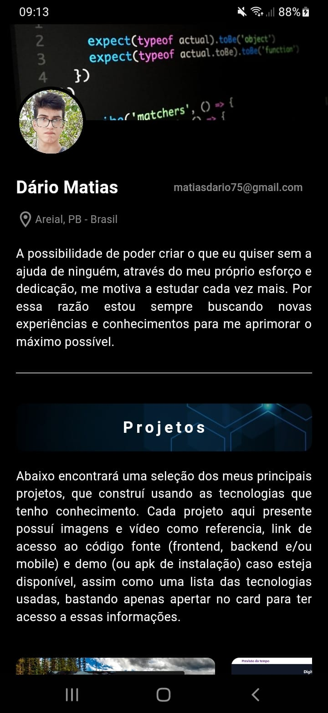
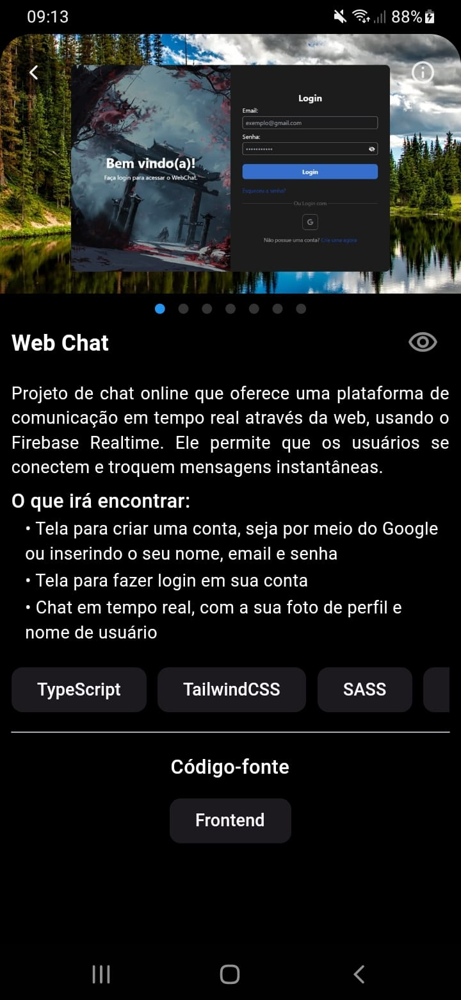
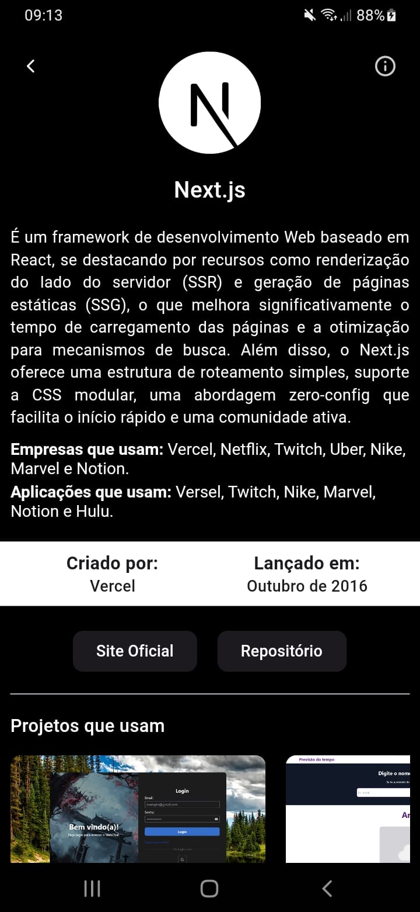

# Portfólio

  
  

## Projeto

### O que irá encontrar:

<ul>
  <li>
    Tela inicial, dividida nas seguintes seções: perfil, com foto, nome, endereço de email, localização e sobre mim; projetos, com todos os meus principais projetos criados; tecnologias, dividido em tecnologias que tenho conhecimento, as que estou estudando e as que tenho intenção de estudar futuramente; contatos, com todas as minhas redes sociais, podendo usá-las para mandar uma mensagem, que são o Linkedin, GitHub, Instagram, Twitter e Website próprio.
  </li>
  <li>
    Tela de projeto, com um carrossel de imagens do projeto e talvez um vídeo de demonstrção, nome, descrição, o que irá encontrar, tecnologias usadas e link para o repositório com seu código fonte.
  </li>
  <li>
    Tela de tecnologia, com a sua logo, nome, descrição, empresas e aplicações que a utilizam (caso tenha sido possível descobrir), quem a criou e data de lançamento, botão para acessarv o site oficial, repositório e playground (caso exista), e por fim, se houver, projetos que a utilizam.
  </li>
</ul>

## Download APK

Link do Drive para poder baixar o APK: [portfolio_mobile](https://drive.google.com/file/d/1pe4tgVPjt3Mfft3td1b8BVrok_hrx_Tp/view?usp=drive_link)

## Screenshots

<h3>Tela inicial</h3>

<h3>Tela projeto</h3>

<h3>Tela tecnologia</h3>

## 🛠 Tecnologias

As seguintes ferramentas foram usadas na construção desse projeto:

-   [Dart](https://dart.dev/)
-   [Flutter](https://flutter.dev/)
-   [Git](https://git-scm.com/)

 

## Autor

  <b>Dário Matias</b>

 
  Entre em contato!
 
 

